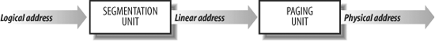

# Linux Memory Addressing

## Memory Addresses

- Logical address
- Linear address
- Physical address

## Segmentation in Hardware

### Segment Selectors and Segmentation Registers

A logical address consists of two parts: a segment identifier and an offset that specifies the relative address within the segment. The segment identifier is a 16-bit field called the Segment Selector , while the offset is a 32-bit field.

- cs The code segment register
- ds The stack segment register
- ss The data segment register
- es fs gs  general purpose register

### Segment Descriptors
- GDT
- LDT

## Segmentation in Linux
