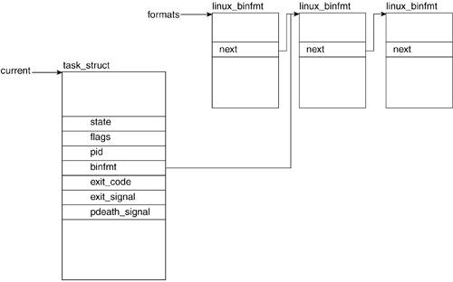
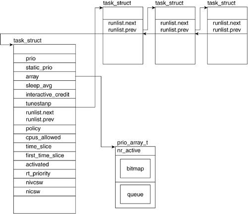
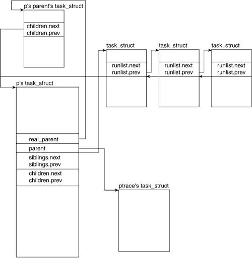
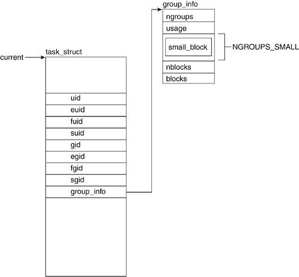
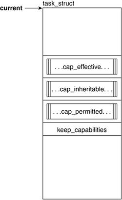
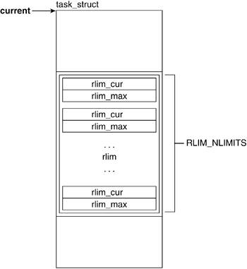
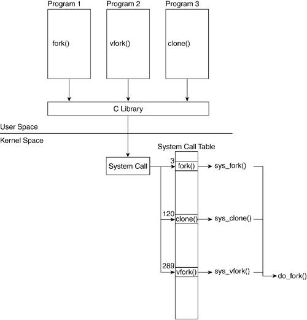

## Process Descriptor

- A simplified task_struct
- include/linux/sched.h


```c
struct task_struct {
    //////////////////////////Process AttributeRelated Fields//////////////////////////////////////
    //The state of the process. Values are TASK_RUNNING, TASK_INTERRUPTIBLE,
    // TASK_UNINTERRUPTIBLE, TASK_ZOMBIE, TASK_STOPPED and TASK_DEAD.
    volatile long state;
    //Flags define special attributes that belong to the task. Values are
    //PF_STARTING, PF_EXITING, PF_DEAD and PF_FORKNOEXEC.
    unsigned long flags;
    //ptrace is set when the ptrace() system call is called on the process for performance measurements.
    unsigned long ptrace;
    //Linux supports a number of executable formats
    struct linux_binfmt *binfmt;
    //the task's exit value and exit signal.
    int exit_code, exit_signal;
    //pdeath_signal is a signal sent upon the parent's death.
    int pdeath_signal;
    //Process Identifer
    pid_t pid;
    //command line
    char comm[16];

    /////////////////////////Scheduling Related Fields///////////////////////////////////////

    //static_prio is equivalent to the nice value. The default value of static_prio is MAX_PRIO-20.
    //prio depends on the processes' scheduling history and the specified nice value
    //he prio field holds +/- 5 of the value of static_prio
    int prio, static_prio;

    //The run_list field points to the runqueue. A runqueue holds a list of all the processes to run.
    struct list_head run_list;

    //The array field points to the priority array of a runqueue
    prio_array_t *array;

    //The sleep_avg field is used to calculate the effective priority of the task,
    //which is the average amount of clock ticks the task has spent sleeping.
    unsigned long sleep_avg;

    //The timestamp field is used to calculate the sleep_avg for when a task sleeps or yields.
    unsigned long long timestamp;

    //The interactive_credit field is used along with the sleep_avg and activated fields to calculate sleep_avg.
    long interactive_credit;

    //The policy determines the type of process (for example, time sharing or real time).
    unsigned long policy;

    //The activated field keeps track of the incrementing and decrementing of sleep averages.
    int activated;

    //The cpus_allowed field specifies which CPUs might handle a task
    cpumask_t cpus_allowed;

    //The time_slice field defines the maximum amount of time the task is allowed to run.
    //The first_time_slice field is repeatedly set to 0 and keeps track of the scheduling time.
    unsigned int time_slice, first_time_slice;

    //rt_priority is a static value that can only be updated through schedule().
    // This value is necessary to support real-time tasks.
    unsigned long rt_priority;

    //real_parent points to the current process' parent's description.
    // It will point to the process descriptor of init()
    // if the original parent of our current process has been destroyed.
    struct task_struct *real_parent;

    //parent is a pointer to the descriptor of the parent process.
    struct task_struct *parent;

    //children is the struct that points to the list of our current process' children.
    struct list_head children;

    //sibling is the struct that points to the list of the current process' siblings.
    struct list_head sibling;

    //A process can be a member of a group of processes,
    //and each group has one process defined as the group leader.
    struct task_struct *group_leader;

    ////////////////////////Process CredentialsRelated Fields////////////////////////////////////////

    //The uid field holds the user ID number of the user who created the process.
    //The gid field holds the group ID of the group who owns the process.
    //The euid effective user ID
    //The egid effective group ID
    //suid (saved user ID) and sgid (saved group ID) are used in the setuid() system calls.
    //The fsuid and fsgid values are checked specifically for filesystem checks.
    // They generally hold the same values as uid and gid except for when a setuid() system call is made.
    uid_t uid, euid, suid, fsuid;
    gid_t gid, egid, sgid, fsgid;


    //In Linux, a user may be part of more than one group.
    //These groups may have varying permissions with respect to system and data accesses.
    // For this reason, the processes need to inherit this credential.
    struct group_info *group_info;

    /////////////////////////////Process CapabilitiesRelated Fields/////////////////////////////////////

    //cap_effective. The capabilities that can be currently used by the process.
    //cap_inheritable. The capabilities that are passed through a call to execve.
    //cap_permitted. The capabilities that can be made either effective or inheritable.
    kernel_cap_t cap_effective, cap_inheritable, cap_permitted;

    //////////////////////////////task_struct Resource Limits////////////////////////////////////
    struct rlimit rlim[RLIM_NLIMITS];

    ////////////////////////////Filesystem- and Address SpaceRelated Fields//////////////////////////////////////
    //The fs field holds a pointer to filesystem information.
    struct fs_struct *fs;
    //The files field holds a pointer to the file descriptor table for the task.
    struct files_struct *files;

    //mm points to address-space and memory-managementrelated information.
    //active_mm is a pointer to the most recently accessed address space. 
    struct mm_struct *mm, *active_mm;

    //////////////////////////////////////////////////////////////////
    pid_t tgid;
    atomic_t usage;
    int lock_depth;
    struct thread_info *thread_info;
    struct list_head tasks;
    struct list_head ptrace_children;
    struct list_head ptrace_list;
    struct pid_link pids[PIDTYPE_MAX];
    wait_queue_head_t wait_chldexit;
    struct completion *vfork_done;
    int __user *set_child_tid;
    int __user *clear_child_tid;
    unsigned long it_real_value, it_prof_value, it_virt_value;
    unsigned long it_real_incr, it_prof_incr, it_virt_incr;
    struct timer_list real_timer;
    unsigned long utime, stime, cutime, cstime;
    //Different kinds of context switches exist.
    unsigned long nvcsw, nivcsw, cnvcsw, cnivcsw;
    u64 start_time;
    int keep_capabilities:1;
    struct user_struct *user;
    unsigned short used_math;
    int link_count, total_link_count;
    unsigned long ptrace_message;
    siginfo_t *last_siginfo;

};
```










##  Process Creation: `fork()`, `vfork()`, and `clone()` System Calls

